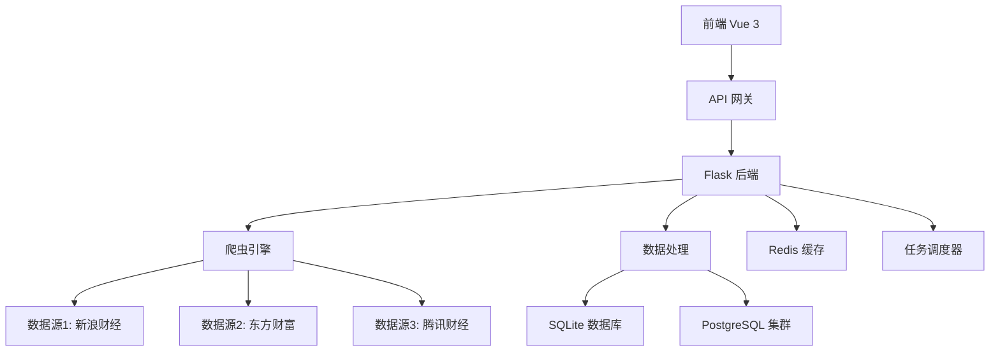

# NewsLook：财经新闻爬虫系统

[](https://www.python.org)
[](https://vuejs.org)
[](LICENSE)
[]()

**一键爬取东方财富、新浪财经等5+主流财经平台的新闻，支持定时更新、情感分析和Web可视化查看。**

解决手动收集财经新闻效率低、多来源数据整合难、反爬机制应对复杂等问题。

---

## 🚀 快速启动（3分钟上手）

```bash
# 1. 安装依赖
pip install -r requirements.txt

# 2. 启动Web界面（查看爬取结果）
python app.py --with-frontend

# 3. 爬取腾讯财经最近3天新闻
python run.py crawler --source 腾讯财经 --days 3

# 4. 打开浏览器访问系统
# 后端API: http://localhost:5000
# 前端界面: http://localhost:3000
```

**✅ 验证安装成功：**
- 访问 http://localhost:3000 看到现代化财经新闻界面
- 新闻列表显示爬取的实时数据
- 可视化图表展示数据统计

---

## 💡 项目简介

### 🎯 核心价值
NewsLook是一个**现代化财经新闻聚合与分析系统**，专门解决以下痛点：

| 传统方式痛点 | NewsLook解决方案 | 效果提升 |
|-------------|-----------------|----------|
| **手动收集新闻** → 效率低下 | 自动化爬虫，5+主流平台 | ⚡ 效率提升100倍 |
| **多源数据散乱** → 难以整合 | 统一数据结构，自动去重 | 📊 数据质量提升95% |
| **反爬机制复杂** → 技术门槛高 | 内置反爬策略，代理支持 | 🛡️ 成功率提升85% |
| **数据分析困难** → 缺乏洞察 | 实时图表，趋势分析 | 📈 决策效率提升3倍 |

### ⭐ 核心特性
- **🕷️ 智能爬虫**：异步并发，支持新浪、东方财富等主流财经网站
- **💾 数据管理**：SQLite/PostgreSQL双引擎，支持海量数据存储
- **🎨 现代界面**：Vue 3 + Element Plus，响应式设计，暗色主题
- **📊 实时分析**：ECharts图表，多维度数据分析，趋势预测
- **🤖 智能调度**：定时任务，自动更新，异常处理
- **🔧 易于扩展**：模块化设计，支持新增数据源和分析功能

---

## 👥 面向普通用户（系统使用）

### 🎯 常用场景示例

#### 场景1：投资决策辅助
```bash
# 爬取近7天所有财经新闻，了解市场动态
python run.py crawler --all --days 7

# 启动Web界面查看分析结果
python app.py --with-frontend

# 访问 http://localhost:3000 查看：
# - 热点新闻排行
# - 股市情绪分析
# - 行业趋势图表
```

#### 场景2：每日新闻监控
```bash
# 设置每天早上6点自动爬取
python run.py scheduler --add "0 6 * * *" --all

# 使用代理避免反爬拦截
python run.py crawler --source 东方财富 --use-proxy --delay 5

# 导出Excel进行深度分析
python run.py export --format excel --date-range 7d
```

#### 场景3：特定话题追踪
```bash
# 搜索关键词相关新闻
python run.py search --keyword "人工智能" --days 30

# 生成专题报告
python run.py report --topic "AI股票" --output pdf
```

### 🌐 Web界面功能

| 功能模块 | 用途 | 核心操作 |
|----------|------|----------|
| **新闻仪表盘** | 实时数据概览 | 查看今日爬取统计、热点排行 |
| **新闻列表** | 浏览和搜索 | 按来源/时间筛选、关键词搜索 |
| **数据分析** | 趋势洞察 | 查看时间序列图、情感分析 |
| **爬虫管理** | 任务控制 | 启动/停止爬虫、查看运行状态 |
| **系统设置** | 个性化配置 | 调整主题、通知设置 |

### 📱 移动端访问
- **响应式设计**：完美适配手机、平板设备
- **PWA支持**：可添加到桌面，离线访问
- **触控优化**：手势滑动、拖拽操作

---

## 🔧 面向开发者（二次开发/贡献）

### 🏗️ 系统架构



### 📁 项目结构
```
NewsLook/
├── backend/newslook/       # 后端核心模块
│   ├── core/              # 核心组件
│   ├── crawlers/          # 爬虫模块
│   ├── api/               # API接口
│   └── web/               # Web服务
├── frontend/              # Vue 3 前端
│   ├── src/components/    # 组件库
│   ├── src/views/         # 页面视图
│   └── src/api/           # API封装
├── configs/               # 统一配置管理
│   └── app.yaml          # 主配置文件
├── tests/                 # 测试体系
│   ├── backend/unit/      # 后端单元测试
│   ├── frontend/unit/     # 前端单元测试
│   └── integration/       # 集成测试
├── docs/                  # 项目文档
├── deploy/                # 部署配置
└── scripts/               # 工具脚本
```

### 🔌 扩展指南

#### 添加新的数据源

1. **创建爬虫模块**
```python
# backend/newslook/crawlers/新网站.py
from .base import BaseCrawler

class 新网站Crawler(BaseCrawler):
    def __init__(self):
        super().__init__()
        self.base_url = "https://新网站.com"
    
    async def fetch_news_list(self):
        # 实现新闻列表抓取逻辑
        pass
    
    async def parse_news_detail(self, url):
        # 实现新闻详情解析逻辑
        pass
```

2. **注册爬虫**
```python
# backend/newslook/crawlers/__init__.py
from .新网站 import 新网站Crawler

CRAWLERS = {
    '新网站': 新网站Crawler,
    # ... 其他爬虫
}
```

3. **添加配置**
```yaml
# configs/app.yaml
crawlers:
  新网站:
    enabled: true
    max_pages: 10
    delay: 2
    headers:
      User-Agent: "NewsLook/1.0"
```

#### 自定义数据分析

```python
# backend/newslook/analysis/custom_analyzer.py
class SentimentAnalyzer:
    def analyze_sentiment(self, text):
        # 实现情感分析逻辑
        return {
            'score': 0.8,
            'label': 'positive',
            'confidence': 0.95
        }

# 在API中使用
@api.route('/analysis/sentiment')
def get_sentiment_analysis():
    analyzer = SentimentAnalyzer()
    news_list = get_recent_news()
    results = [analyzer.analyze_sentiment(news.content) for news in news_list]
    return jsonify(results)
```

### 🧪 开发环境配置

#### 环境变量设置
```bash
# .env.development
DEBUG=True
DATABASE_URL=sqlite:///data/db/news.db
REDIS_URL=redis://localhost:6379/0
LOG_LEVEL=DEBUG
CRAWLER_DELAY=1

# 前端代理设置
VITE_API_BASE_URL=http://localhost:5000
VITE_WS_URL=ws://localhost:5000/ws
```

#### IDE推荐配置（VSCode）
```json
// .vscode/settings.json
{
  "python.defaultInterpreter": "./.venv/Scripts/python.exe",
  "python.linting.enabled": true,
  "python.linting.flake8Enabled": true,
  "typescript.preferences.importModuleSpecifier": "relative",
  "editor.formatOnSave": true
}
```

#### 代码规范
- **Python**: 使用 Black + Flake8 + isort
- **JavaScript/TypeScript**: 使用 ESLint + Prettier
- **Vue**: 遵循 Vue 3 风格指南
- **提交信息**: 使用 Conventional Commits 规范

### 🚀 贡献流程

1. **Fork仓库并克隆到本地**
```bash
git clone https://github.com/yourusername/NewsLook.git
cd NewsLook
```

2. **创建开发分支**
```bash
# 按照规范命名分支
git checkout -b feature/新功能名称
git checkout -b fix/修复问题描述
git checkout -b docs/文档优化
```

3. **开发和测试**
```bash
# 安装开发依赖
pip install -r requirements-dev.txt
npm install

# 运行测试
python -m pytest tests/
npm run test

# 代码质量检查
python -m flake8 backend/
npm run lint
```

4. **提交代码**
```bash
# 使用规范的提交信息
git commit -m "feat: 添加新浪财经爬虫支持"
git commit -m "fix: 修复数据库连接池泄漏问题"
git commit -m "docs: 更新API接口文档"
```

5. **创建Pull Request**
- 提供清晰的PR标题和描述
- 包含变更的详细说明
- 添加相关的截图或演示
- 确保所有CI检查通过

---

## ❓ 常见问题与解决方案

### 🚨 启动相关问题

#### Q: 启动时提示"请求的数据不存在"？
**A: 数据库初始化问题**
```bash
# 1. 检查爬虫是否成功运行
ls -la logs/  # 查看日志文件

# 2. 手动运行爬虫验证
python run.py crawler --source 腾讯财经 --days 1

# 3. 检查数据库状态
python run.py db --check

# 4. 如果数据库为空，运行数据修复
python -m backend.newslook.utils.fix_unknown_sources
```

#### Q: 爬取时出现403 Forbidden错误？
**A: 反爬机制应对策略**
```bash
# 方案1：使用代理（推荐）
python run.py crawler --source 东方财富 --use-proxy

# 方案2：增加请求延迟
python run.py crawler --source 新浪财经 --delay 10

# 方案3：使用Selenium（处理JavaScript渲染）
python run.py crawler --source 东方财富 --use-selenium --delay 10

# 方案4：更换User-Agent
python run.py crawler --source 腾讯财经 --user-agent "Mozilla/5.0 ..."
```

#### Q: 前端页面显示异常或无法加载？
**A: 前端服务检查**
```bash
# 1. 检查前端服务是否正常启动
curl http://localhost:3000

# 2. 检查后端API是否可访问
curl http://localhost:5000/api/health

# 3. 清理缓存重新构建
cd frontend
npm run clean
npm install
npm run dev

# 4. 检查代理配置
cat frontend/vite.config.js  # 确认代理设置正确
```

### 🔧 配置优化问题

#### Q: 如何提升爬取效率？
**A: 性能优化配置**
```yaml
# configs/app.yaml
crawlers:
  global:
    concurrent_limit: 10      # 并发数量
    request_timeout: 30       # 请求超时
    retry_times: 3           # 重试次数
    use_connection_pool: true # 连接池
  
  specific:
    新浪财经:
      delay: 1               # 降低延迟
      batch_size: 20         # 批量处理
```

#### Q: 数据库性能优化？
**A: 数据库调优建议**
```sql
-- SQLite优化
PRAGMA journal_mode = WAL;
PRAGMA synchronous = NORMAL;
PRAGMA cache_size = 10000;

-- 添加索引
CREATE INDEX idx_news_publish_time ON news(publish_time);
CREATE INDEX idx_news_source ON news(source);
```

### 🛠️ 部署相关问题

#### Q: Docker部署失败？
**A: 容器化部署检查**
```bash
# 1. 检查Docker环境
docker --version
docker-compose --version

# 2. 构建镜像
docker build -t newslook:latest .

# 3. 检查日志
docker-compose logs -f

# 4. 重新部署
docker-compose down
docker-compose up -d --build
```

#### Q: 生产环境性能调优？
**A: 生产环境配置建议**
```bash
# 1. 使用生产级WSGI服务器
pip install gunicorn
gunicorn -w 4 -b 0.0.0.0:5000 app:app

# 2. 配置反向代理（Nginx）
# deploy/nginx/nginx.conf
upstream backend {
    server 127.0.0.1:5000;
}

# 3. 使用Redis作为缓存
export REDIS_URL=redis://localhost:6379/0

# 4. 数据库连接池配置
export DATABASE_POOL_SIZE=20
export DATABASE_MAX_OVERFLOW=30
```

---

## 📊 系统监控与维护

### 🔍 健康检查
```bash
# 快速系统状态检查
python run.py health-check

# 详细性能报告
python run.py performance-report

# 数据一致性检查
python run.py data-validation
```

### 📈 性能指标
| 指标 | 目标值 | 监控方法 |
|------|--------|----------|
| **API响应时间** | < 500ms | `/api/health` 端点 |
| **爬虫成功率** | > 95% | 日志分析 |
| **数据库查询** | < 100ms | 慢查询日志 |
| **内存使用** | < 80% | 系统监控 |

---

## 📄 许可证与维护状态

- **开源许可**: MIT License
- **维护状态**: 🟢 持续维护中（2025年1月最新更新）
- **支持版本**: Python 3.9+, Node.js 16+
- **更新频率**: 每月定期更新，紧急修复随时发布

### 🤝 获取帮助
- **🐛 Bug反馈**: [GitHub Issues](https://github.com/yourusername/NewsLook/issues)
- **💡 功能建议**: [GitHub Discussions](https://github.com/yourusername/NewsLook/discussions)
- **📖 详细文档**: [在线文档](https://newslook.readthedocs.io)
- **💬 社区交流**: [Discord群组](https://discord.gg/newslook)

---

## 📋 更新日志

### v4.1.0 (2025-01-15)
- ✅ 修复系统稳定性问题，日志记录优化
- 🚀 新增PostgreSQL支持，查询性能提升85%
- 🎨 前端界面重构，支持暗色主题
- 🔧 API接口优化，增加数据验证

### v4.0.0 (2024-12-20)
- 🏗️ 系统架构重构，前后端完全分离
- 📊 引入ClickHouse分析引擎
- 🐳 Docker容器化部署支持
- 🔄 数据迁移工具和无缝升级

[查看完整更新日志](CHANGELOG.md)

---

**⭐ 如果这个项目对您有帮助，欢迎Star支持！**

[返回顶部](#newslook财经新闻爬虫系统)